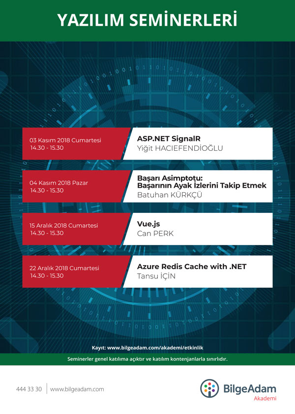

# ASP.NET SignalR
**Konuşmacı:** Yiğit HACIEFENDİOĞLU



**Tarih:** 03.11.2018

**Başlangıç - Bitiş Saati:** 14:30 - 15:30

**Yer:** Bilge Adam Ankara

**İlgili Alanlar:** Yazılım, programlama, ASP.NET, SignalR, web development, real-time, bi-directional communication

**Etkinlik Linki:** http://www.bilgeadam.com/akademi/etkinlik?KeyID=1041&BA=1

## Faydalı Linkler
- https://docs.microsoft.com/en-us/aspnet/signalr/
- https://docs.microsoft.com/en-us/aspnet/signalr/overview/getting-started/tutorial-getting-started-with-signalr

## ASP.NET SignalR Nedir?
- ASP.NET geliştiricilerinin gerçek zamanlı web uygulaması geliştirme sürecini aşırı kolay hale getiren bir kütüphanedir.
- Server ve Client arasında çift yönlü (bi-directional) sürekli bağlantı sağlar.
- Web Sockets’i destekler.
- Yeni teknolojileri desteklemeyen eski tarayıcılarda çalışabilmesi için o tarayıcılara uygun teknikleri (polling, forever frames, vs) de ihtiyaç halinde kullanır.

## SignalR Fallback
- Web Sockets
- Server Sent Events
- Forever Frames
- Long Polling

## Kurulum
Bir ASP.NET Web Application projesi açıldıktan sonra NuGet Package Manager aracılığıyla Microsoft.AspNet.SignalR kütüphanesi yüklenir.

> Install-Package Microsoft.AspNet.SignalR

## OWIN Startup (Startup.cs)
```csharp
using Microsoft.Owin;
using Owin;

[assembly: OwinStartup(typeof(SignalRDemo.Startup))]
namespace SignalRDemo
{
    public class Startup
    {
        public void Configuration(IAppBuilder app)
        {
            // For more information on how to configure your application, visit https://go.microsoft.com/fwlink/?LinkID=316888
            app.MapSignalR();
        }
    }
}

```

## ChatHub.cs
```csharp
using Microsoft.AspNet.SignalR;

namespace SignalRDemo.Hubs
{
    public class ChatHub : Hub
    {
        public void Send(string sender, string message)
        {
            Clients.Others.broadcastMessage(sender, message);
        }
    }
}
```

## index.html
```html
<script src="Scripts/jquery-3.3.1.min.js"></script> 
<script src="Scripts/jquery.signalR-2.3.0.min.js"></script>
<script src="signalr/hubs"></script>
<script>
//SignalR'ı burada kullan
</script>
```
## JavaScript
```javascript
var hub = $.connection.chatHub;
hub.client.broadcastMessage = function (sender, message) {
    // server'dan gelen mesajı göndereniyle kullan
};

// bağlantıyı başlat
$.connection.hub.start().done(function () {

    // sunucudaki send metodunu çağır
    hub.server.send("Gönderen", "Mesaj");
  
});
```
